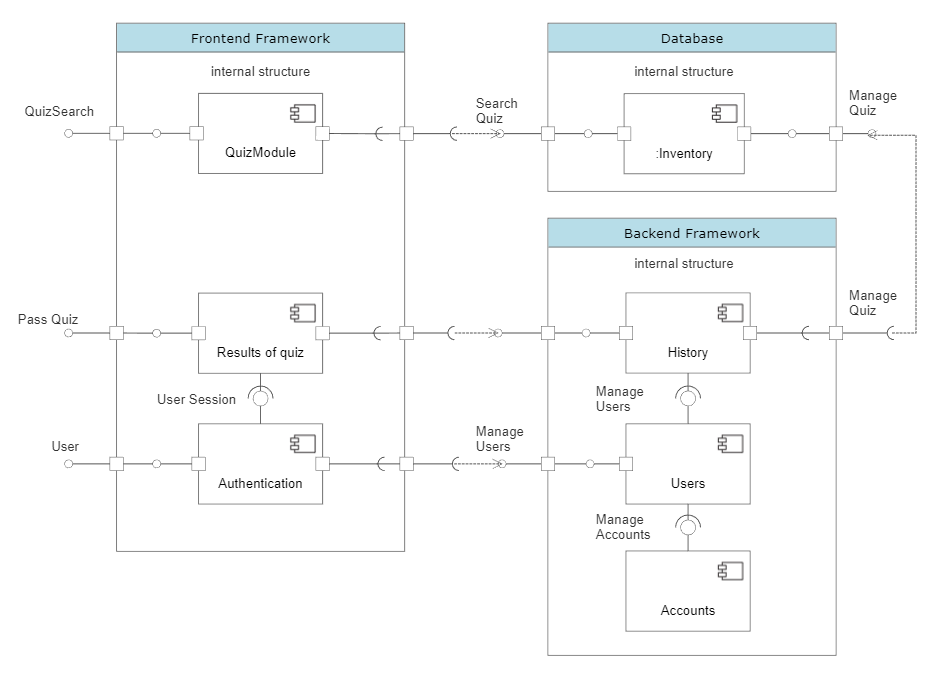

# Alternative Architecture

1.	Frontend Framework: React or Vue.js

React and Vue.js are both powerful front-end frameworks that offer different strengths for developing web applications. React's flexibility and performance make it an ideal choice for large-scale projects that require dynamic updates and real-time rendering. Additionally, its virtual DOM feature makes it more efficient by only updating the parts of the UI that have changed.

Vue.js, on the other hand, is known for its simplicity and ease of use, making it a popular choice for smaller and less complex applications. It has a shallow learning curve, making it an attractive option for developers who are new to front-end development. Vue.js is also a lightweight framework that is easy to integrate with other libraries and tools, allowing for more flexibility in terms of development options.

2.	Backend Framework: Django (Python) or Ruby on Rails (Ruby)

Django and Ruby on Rails are both popular backend frameworks that offer developers a wide range of tools and features for building web applications. Django, based on Python, is known for its flexibility, scalability, and security. It provides a robust set of features that enable developers to build complex web applications quickly and efficiently. Django also has a large community of developers and an extensive set of documentation, making it an attractive choice for both beginners and experienced developers.

Ruby on Rails, on the other hand, is known for its simplicity and ease of use. It has a strong focus on convention over configuration, making it easy to set up and get started with. Ruby on Rails also has a vibrant and supportive community, with a wealth of resources available to help developers at all levels.

Both Django and Ruby on Rails follow the Model-View-Controller (MVC) design pattern, which helps to separate the concerns of the application into different layers, making it easier to maintain and scale. They both also come with an extensive set of pre-built components, including user authentication, routing, and database management, which can significantly reduce development time and effort.

3.	API Design: REST or GraphQL

Instead of rendering views on the server using Pug, we can build a separate API to serve data to our frontend. This can help us decouple the frontend and backend, making it easier to scale and maintain our application.

REST (Representational State Transfer) is a popular architectural style for designing networked applications. It uses HTTP methods (GET, POST, PUT, DELETE) to perform operations on resources that URLs identify.
GraphQL is an alternative to REST developed by Facebook. It is a query language that enables us to request the exact data we need, reducing the amount of over- or under-fetching of data. GraphQL allows for a more flexible and efficient API design.

4.	Database: PostgreSQL or MySQL

PostgreSQL and MySQL are both solid choices that provide a wealth of features and support for transactions. Both databases are open-source and widely used, providing excellent performance and robust querying capabilities. They are particularly useful for applications that require a relational database management system, as opposed to the NoSQL approach used by Firebase.

5.	Authentication and Authorization: JWT or Auth0

JWT, or JSON Web Tokens, is a compact and secure way of representing claims between parties. It can be used for authentication and authorization, as well as for data exchange. JWT tokens are generated by the server and contain information about the user, such as their name, email address, and other relevant data. They are often used in stateless environments, such as RESTful APIs, and can be easily integrated with different programming languages and platforms.

Auth0 is a service that provides authentication and authorization as a service, making it easy to implement these features in your web application. It offers features such as single sign-on (SSO), multi-factor authentication (MFA), and social login integrations, making it a comprehensive solution for authentication and authorization needs. Auth0 can be used with different programming languages and platforms, including JavaScript, Node.js, and React.

## How it would affect team process and activities 
Since most of these suggestions will change the stack of our project significantly, we need to make sure all of our members are prepared to with the switch. If there are any members who do not have experience with the new frameworks, we need to schedule for peer study sessions or more extensive code reviews/help to guide them through the changes.

Besides, sprint meetings for group tasks and status updates, we will also need to have training sessions for less experience team members. 

