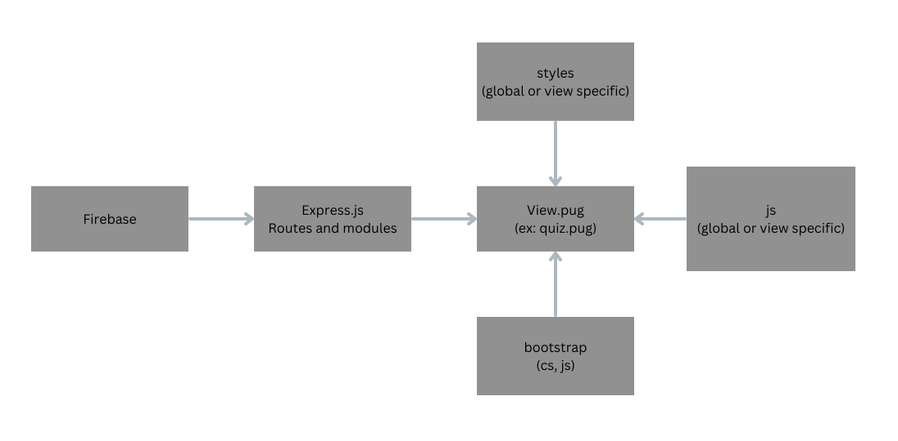

## Front-End Developement Structure review 

Since we chose Express.js as server framework, we have chosen [PUG](https://pugjs.org/api/getting-started.html) and our templating language. 

It is a new challenge for everyone in the front-end team, but as reviewing it, it's not too different from HTML, we just need to get used to PUG's syntax. 

When a route is called with a specific view, the route would then send needed data to the view to display. 

For example: When the route `/quiz/1` is called, the route would then make a call to the API to get the response back and process the data to send clean and formatted response to the view. 

The view then do what it needs to display to data correctly. In the above example, the quiz view will loop and show all answer choices for each question. 

The view should also be able to make POST to the correct routes as needed. The view will send all needed parameters for the route to make a request to our API. 

For example: Create a new user, we need to send the email and password to create a new account. 

Each view is an extension of `layout.pug`. In this layout, we will load all scripts and styles as global assets. However, layout would have block like content/footer/script so that other specific layout can extend it freely but still keep the global functionalities.

We also chose to use bootstrap as our front-end package framework. This will help us to speed up our development process. 

We also have common style.css file to share among all screens and javascript file specifically for each screen. 

Here is a diagram to show the overview of what needed for the front-end to display correctly. 

