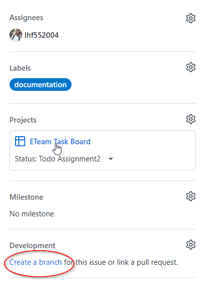
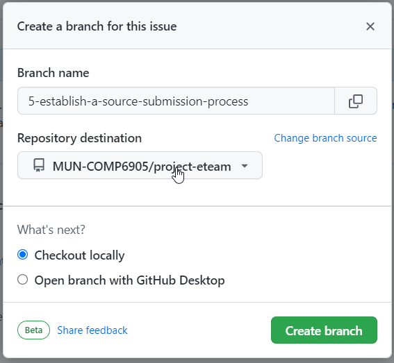
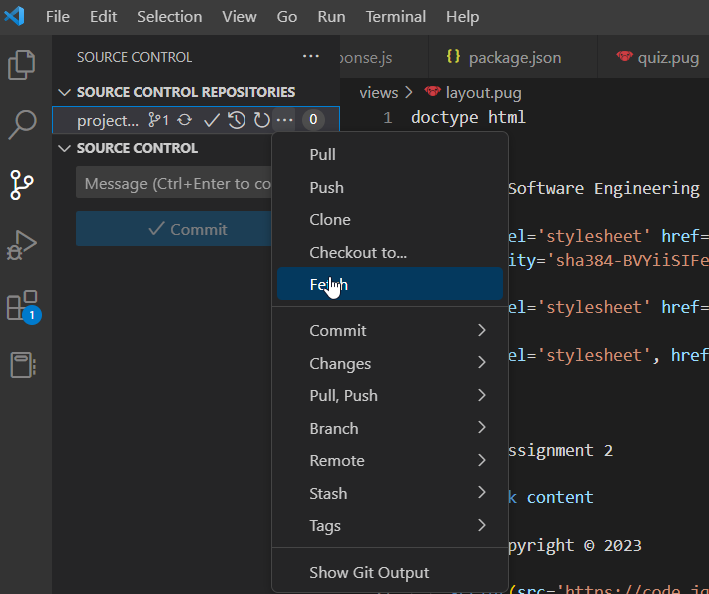
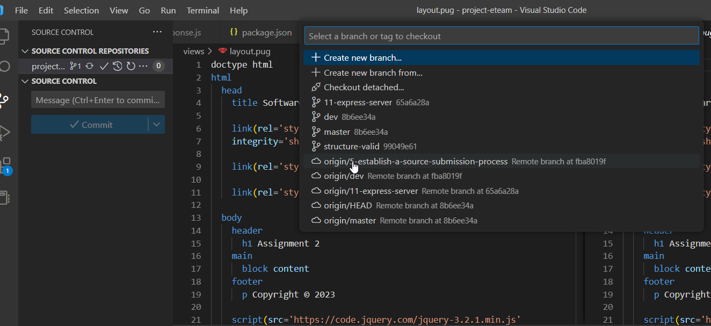
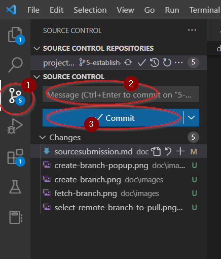
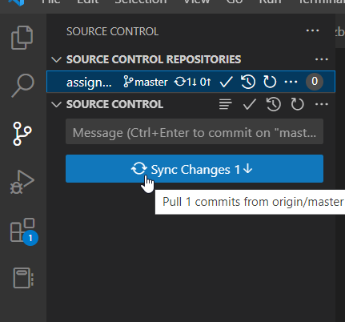

## Source submission process
Source control is based on Git. There is the tutorial of [git on VScode](https://code.visualstudio.com/docs/sourcecontrol/overview) 

Here is source submission process 

1. Create or select your task, and assign to yourself or other team member, assign the project "E-Team", assign the label

2. Create own branch from latest dev branch to develop
   
   You don't need to do it manually, you can create the branch for task
   
   
   Confirm it:

   

3. Get the repository from specific branch at first time

   `git clone -b dev https://github.com/MUN-COMP6905/project-eteam.git`

4. If you already download the project. You can fetch the branch firstly in VScode.

   

5. Then pull your branch from remote in VScode

   

6. After your coding and testing, commit your code 

  

2. Submit your own branch to repository

  

3. Create pull request to merge your branch to dev branch
  

4. At end of sprint, publish new version to master branch
   
   The same as your merge to dev branch